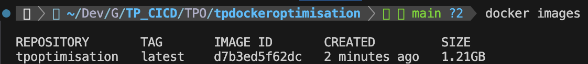

## TP Optimisation

# Optimisation d'une application Node.js & Dockerfile

## 🐛 Problèmes initiaux
- Dockerfile trop lourd (`node:latest`, apt-get inutile).
- Mauvais cache (`COPY .` avant `npm install`).
- Copie de `node_modules` → non portable.
- Exposition de ports inutiles.
- Application bloquante (`fs.readFileSync`).
- Logs verbeux en production.
- Container lancé en `root`.
---

## ✅ Itérations d’optimisation

### État initial (1.21GB)


### Commit 1 – Alléger l’image Docker
> Building 0.7s (12/12) FINISHED 
> Size: 142MB
- Passage à `node:20-alpine`.
- Suppression des paquets inutiles.
- Meilleure gestion du cache (`COPY package*.json` avant `npm ci`).
- Suppression de `COPY node_modules`.
- Exposition uniquement du port `3000`. (Passé à `8000` dans le code car j'utilise déjà le `3000` pour autre chose)

### Commit 2 – Sécurisation & bonnes pratiques
- `ENV NODE_ENV=production`.
- Suppression de `RUN npm run build` (inutile).
- Ajout de `USER node`.

### Commit 3 – Optimisation du code
- Passage de `fs.readFileSync` à `fs.promises.readFile` (asynchrone).
- Ajout de gestion d’erreurs (try/catch).
- Prévention de surcharge mémoire.

### Commit 4 – Logs
- Ajout de `morgan` pour un logging propre.
- Désactivation des logs verbeux en production.

### Commit 5 – Documentation
- Rédaction de ce README.
- Instructions de build et run :
  ```bash
  docker build -t myapp .
  docker run -p 3000:3000 myapp
